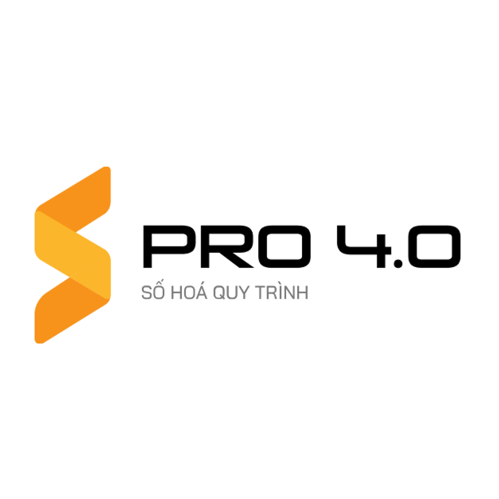

<div id="top"></div>

<!-- PROJECT LOGO -->
<br />
<div align="center">
  <a href="https://github.com/othneildrew/Best-README-Template">
    
  </a>

  <h3 align="center">SPRO 4.0</h3>

  <p align="center">
    Ứng dụng mobile số hóa các quy trình của doanh nghiệp!
    <br />
    <a href="https://github.com/othneildrew/Best-README-Template"><strong>Explore the docs »</strong></a>
    <br />
    <br />
    <a href="https://github.com/othneildrew/Best-README-Template">Xem demo</a>
    ·
    <a href="https://github.com/othneildrew/Best-README-Template/issues">Report Bug</a>
    ·
    <a href="https://github.com/othneildrew/Best-README-Template/issues">Request Feature</a>
  </p>
</div>


<!-- TABLE OF CONTENTS -->
<details>
  <summary>Mục lục</summary>
  <ol>
    <li>
      <a href="#about-the-project">Tổng quan dự án</a>
      <ul>
        <li><a href="#built-with">Xây dựng với</a></li>
      </ul>
    </li>
    <li>
      <a href="#getting-started">Bắt đầu</a>
      <ul>
        <li><a href="#prerequisites">Bắt buộc</a></li>
        <li><a href="#installation">Cài đặt soruce code</a></li>
      </ul>
    </li>
    <li><a href="#roadmap">Lộ trình phát triển</a></li>
    <li><a href="#contributing">Phát triển ứng dụng</a></li>
    <li><a href="#contributing">Tài liệu liên quan</a></li>
    <li><a href="#license">Bản quyền</a></li>
    <li><a href="#contact">Liên hệ</a></li>
  </ol>
</details>


<!-- ABOUT THE PROJECT -->
## Tổng quan dự án

[![Product Name Screen Shot][product-screenshot]](https://example.com)

Spro 4.0 là dự án kết hợp từ BA Online và Sflash, dùng để triển khai cho các khách hàng của OBC.
Mỗi công ty khách hàng sẽ có mã code và server riêng. Nhân viên của công ty có thể truy cập vào ứng dụng dựa vào
mã công ty và tài khoản cá nhân. Tạo các ticket đối với các quy trình của công ty mình hoặc duyệt các ticket của 
người khác. Ngoài ra Sflash cung cấp việc tạo nhiệm vụ, quản lý các công việc cá nhân, tập thể ( tương tự trello )

Vậy nên app có các chức năng chính:
* Đổi mã code tương ứng với từng công ty khách hàng
* Xử lý điều hướng notification
* Tạo ticket, phê duyệt ticket.
* Tạo task, quản lý tiến độ của task :smile:

### Xây dựng với

Ứng dụng được xây dựng bởi các thư viện, nền tảng cơ bản dưới dây. Ngoài ra còn nhiều thư viện khác có thể tìm thấy trong package.json

* [React Native](https://reactnative.dev/)
* [Firebase](https://firebase.google.com/)
* [JavaScript](https://www.w3schools.com/js/)
* [Redux](https://redux.js.org/)
* [Redux-Saga](https://redux-saga.js.org/)

<!-- GETTING STARTED -->
## Bắt đầu

Dưới đây là hướng dẫn cơ bản để chạy được ứng dụng

### Bắt buộc

Bạn cần chắc chắn đã đọc:
*  [Tài liệu cài đặt môi trường](https://reactnative.dev/docs/environment-setup) 

### Cài đặt

1. Tải source code về máy
   ```sh
   git clone https://gitlab.fis.vn/tdchcm/spro4.0
   ```
2. Cài đặt các submodule con
   ```sh
   git submdule init
   ```
   ```sh
   git submdule update
   ```
3. Cài đặt các thư viện NPM
   ```sh
   npm install
   ```
4. Link các font chữ
   ```js
   npx react-native link
   ```
5. Chạy ứng dụng
  Android
  ```js
   npx react-native run-android
   ```
  IOS
  ```js
   npx react-native run-ios
   ```

<!-- ROADMAP -->
## Lộ trình phát triển

- [x] Cập nhật file ReadMe
- [x] Thêm tính năng nhận thông báo về ticket
- [x] Thêm tính năng đăng nhập bằng vân tay
- [x] Thêm tính năng đăng nhập một lần
- [ ] Hỗ trợ đa ngôn ngữ
    - [x] Tiếng Anh
    - [x] Tiếng Việt
    - [ ] Tiếng Nhật
- [ ] Xây dựng chức năng tìm kiếm, lọc ticket

Kiểm tra các [open issues](https://jira.fis.com.vn/projects/FSB_EVN_SPRO_2021_PM) để có danh sách đầy đủ các tính năng được đề xuất (và các vấn đề đã biết).

## Phát triển ứng dụng

Để xây dựng và tiếp tục phát triển ứng dụng này, bạn cần **đọc thật kỹ** các lưu ý dưới đây

1. Check out Spro từ Branch "SPro4_v1"
2. Check out BaOnline từ Branch "Spro4_BA_v1"
3. Check out SFlash từ Branch "Spro4.0_V1_code"
4. Tạo 1 Branch cá nhân (`git checkout -b yourBranch`)
5. Commit các thay đổi của mình (`git commit -m 'Viết Commit Message rõ ràng'`)
6. Push to the Branch (`git push origin yourBranch`)
7. Pull code từ 3 branch gốc
8 . Cập nhật thay đổi và tạo merge request tới branch gốc

## Tài liệu liên quan

Các tài liệu liên quan đến dự án!
### API
* [API SPro](https://gitlab.fis.vn/tdchcm/spro4.0/src/-/blob/updateReadme/docs/API/BA-Online%20APIS%202.postman_collection.json)
* [API Sflash](https://gitlab.fis.vn/tdchcm/spro4.0/src/-/blob/updateReadme/docs/API/SFLASH.postman_collection.json)
* [API Bộ Lọc, Tìm kiếm ticket](https://gitlab.fis.vn/tdchcm/spro4.0/src/-/blob/updateReadme/docs/API/NPC)
* [API BA ONLINE](https://gitlab.fis.vn/tdchcm/spro4.0/src/-/blob/updateReadme/docs/API/TDC_HCM_BA_Online.postman_collection)
* [API SSO IHRMS](https://gitlab.fis.vn/tdchcm/spro4.0/src/-/blob/updateReadme/docs/API/SSO_EVN_HN.postman_collection.json)
### Tài liệu khác
* [Tài liệu hướng dẫn sử dụng app](https://gitlab.fis.vn/tdchcm/spro4.0/src/-/blob/updateReadme/docs/API/HDSD.docx)
* [Tài liệu SSO IHRMS](https://gitlab.fis.vn/tdchcm/spro4.0/src/-/blob/updateReadme/docs/API/EVNHN_iHRMS_2021_PM_.docx)
* [Tài liệu SSO PTI](https://gitlab.fis.vn/tdchcm/spro4.0/src/-/blob/updateReadme/docs/API/SSO_PTI.pdf)
* [Tài liệu Config Notificatio](https://gitlab.fis.vn/tdchcm/spro4.0/src/-/blob/updateReadme/docs/ConfigNotification.docx)
* [Xử lý controltype ApiWeb](https://gitlab.fis.vn/tdchcm/spro4.0/src/-/blob/updateReadme/docs/Mobile-SPro-ApiWeb.xlsx)
* [Tài liệu tổng quan ứng dụng](https://gitlab.fis.vn/tdchcm/spro4.0/src/-/blob/updateReadme/docs/URD_SRS_Spro4.0_MB.docx)
* [Tài liệu xử lý FeederData](https://gitlab.fis.vn/tdchcm/spro4.0/src/-/blob/updateReadme/docs/feederData.txt)

<!-- LICENSE -->
## Bản quyền

Bản quyền thuộc về trung tâm [FIS.DDC – Digital Development Center](fis.tdc.hcm@gmail.com) .

<!-- CONTACT -->
## Liên hệ

Digital Development Center - fis.tdc.hcm@gmail.com

Liên kết đến dự án: [https://gitlab.fis.vn/tdchcm/spro4.0](https://gitlab.fis.vn/tdchcm/spro4.0)


<!-- MARKDOWN LINKS & IMAGES -->
[contributors-shield]: https://img.shields.io/github/contributors/othneildrew/Best-README-Template.svg?style=for-the-badge
[contributors-url]: https://github.com/othneildrew/Best-README-Template/graphs/contributors
[forks-shield]: https://img.shields.io/github/forks/othneildrew/Best-README-Template.svg?style=for-the-badge
[forks-url]: https://github.com/othneildrew/Best-README-Template/network/members
[stars-shield]: https://img.shields.io/github/stars/othneildrew/Best-README-Template.svg?style=for-the-badge
[stars-url]: https://github.com/othneildrew/Best-README-Template/stargazers
[issues-shield]: https://img.shields.io/github/issues/othneildrew/Best-README-Template.svg?style=for-the-badge
[issues-url]: https://github.com/othneildrew/Best-README-Template/issues
[license-shield]: https://img.shields.io/github/license/othneildrew/Best-README-Template.svg?style=for-the-badge
[license-url]: https://github.com/othneildrew/Best-README-Template/blob/master/LICENSE.txt
[linkedin-shield]: https://img.shields.io/badge/-LinkedIn-black.svg?style=for-the-badge&logo=linkedin&colorB=555
[linkedin-url]: https://linkedin.com/in/othneildrew
[product-screenshot]: images/screenshot.png